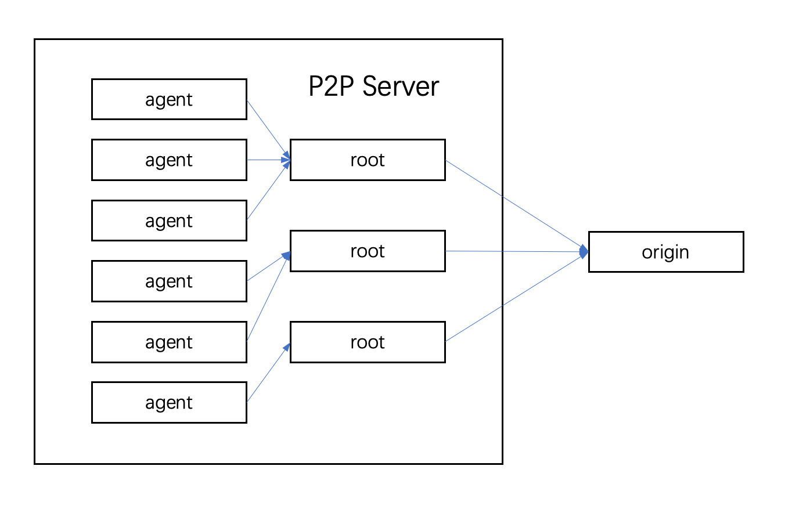

# DadiP2P

DadiP2P is an accelerator that uses P2P protocol to speed up HTTP file download, usually use for docker image layer download.

The key features are:

* **High Performance**

  We use P2P protocol and chunked-file transfer. Use P2P protocol can reduce the pressure on the origin, and use chunked-file can allow client parallel download from the P2P network. These initiatives can dramatically increase transfer speed. We also use LRU cache to store chunked-file to speed up file reading and reduce file storage space.

* **High Reliability**

  When any node unserviceable, we will automatic redirect to other node. And if current node is shutdown, we will automatic restart this node and try to rebuild LRU cache.

## Getting Started

#### Build From Source

> ##### Requirements
>
> * Golang >= 1.15.x

```shell
git clone https://github.com/alibaba/accelerated-container-image.git
cd accelerated-container-image
make
```

The DadiP2P binary are generated in `bin`.

> If you are in China mainland and download gomod failed, you can use goproxy to speed up download.
>
> ```shell
> export GOPROXY=https://mirrors.aliyun.com/goproxy/
> ```

### Configure

The default configure file is [dadip2p.yaml](https://github.com/alibaba/accelerated-container-image/blob/main/dadip2p.yaml), you can direct edit it.

### Run

```shell
./p2p -c dadip2p.yaml
```

## Overview

DadiP2P consists of a proxy server and a P2P server.

Proxy server will hijack users' requests. if match rule, proxy will redirect the request to P2P server.

Proxy server support forward proxy and reverse proxy, see [PROXY_MODE](https://github.com/taoting1234/accelerated-container-image/blob/main/docs/PROXY_MODE.md).

P2P server have two types of nodes: root node and agent node, all nodes are available for external service.

* Only root node will download from origin.
* Agent node will download from root node or redirect to another agent node.



## Licenses

Accelerated Container Image is released under the Apache License, Version 2.0.