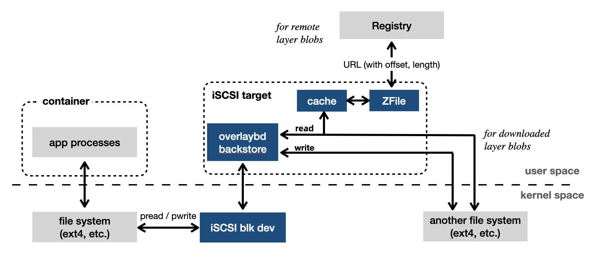

# Accelerated Container Image

Accelerated Container Image is an open-source implementation of paper ["DADI: Block-Level Image Service for Agile and Elastic Application Deployment. USENIX ATC'20"](https://www.usenix.org/conference/atc20/presentation/li-huiba).

DADI (Data Accelerator for Disaggregated Infrastructure) is a solution for container acceleration including remote image and other features,
and has been widely used in Alibaba and Alibaba Cloud, and already supported by Alibaba Cloud Registry (ACR).

At the heart of the acceleration is OverlayBD, which provides a merged view of a sequence of block-based layers as an iSCSI block device.
It can be used for container acceleration by supporting fetching image data on-demand without downloading and unpacking the whole image before a container running. With OverlayBD image format, we can cold start a container instantly.

The key features are:

* **High Performance**

    It's a block-device-based storage of OCI image, which has much lower complexity than filesystem-based implementations. For example, cross-layer hardlink and non-copy commands like chown are very complex for filesystem-based image without copying up, but is natively supported by OverlayBD. OverlayBD outperforms filesystem-based solutions in performance. Evaluation data is stated in [DADI paper](https://www.usenix.org/conference/atc20/presentation/li-huiba).

* **High Reliability**

    OverlayBD outputs block devices through iSCSI protocol, which is widely used and supported in most operation systems. OverlayBD backing-store can recover from failures or crashes.

* **Native Support for Writable**

    OverlayBD can be used as writable/container layer. The end-users can build their OverlayBD images naturally without conversion.

## Getting Started

* See how to build and install OverlayBD component at [README](https://github.com/alibaba/overlaybd).

* See how to build snaphshotter and ctr plugin components at [BUILDING](docs/BUILDING.md).

* See how to install at [INSTALL](docs/INSTALL.md).

* After build or install, see our examples at [EXAMPLES](docs/EXAMPLES.md).

* Welcome to contribute! [CONTRIBUTING](docs/CONTRIBUTING.md)

## Overview

With OCI image spec, an image layer blob is saved as a tarball on the registry, describing the [changeset](https://github.com/opencontainers/image-spec/blob/v1.0.1/layer.md#change-types) based on it's previous layer. However, tarball is not designed to be seekable and random access is not supported. Complete downloading of all blobs is always necessary before bringing up a container.

An OverlayBD blob is a collection of modified data blocks under the filesystem and corresponding to the files added, modified or deleted by the layer. OverlayBD iSCSI backing-store is used to provide the merged view of layers and provides a virtual block device through iSCSI protocol. Filesystem is mounted on top of the device and an overlaybd blob can be accessed randomly and supports on-demond reading natively.

The raw data of block differences, together with an index to the raw data, constitute the OverlayBD blob. When attaching and mounting an OverlayBD device, only indexes of each layer are loaded from remote, and stored in memory. For data reading, overlaybd performs a range lookup in the index to find out where in the blob to read and then performs a remote fetching. That blob is in Zfile format.

Zfile is a new compression file format to support seekable decompression, which can reduce storage and transmission costs. And also the checksum information to protect against data corruptions for on-demand reading is stored in Zfile. In order to be compatible with existing registries and container engines, Zfile is wrapped by a tar file, which has only one Zfile inside.

OverlayBD connects with applications through a filesystem mounted on an iSCSI block device. OverlayBD is agnostic to the choice of filesystem so users can select one that best fits their needs. I/O requests go from applications to a regular filesystem such as ext4. From there they go to iSCSI device and then to the user-space tgt - OverlayBD backing-store. Backend read operations are always on layer files. Some of the layer files may have already been downloaded, so these reads would hit local filesystem. Other reads will be directed to registry. Write and trim operations are handled by OverlayBD backing-store which writes the data and index files of the writable layer to the local file system. For more details, see the [paper](https://www.usenix.org/conference/atc20/presentation/li-huiba).

## Components

*  [OverlayBD](https://github.com/alibaba/overlaybd)

    OverlayBD provides a merged view of block-based layer sequence as a third-party backing-store of tgt, which is an user space iSCSI target framework. 

* OverlayBD-snapshotter

    OverlayBD snapshotter is a containerd snapshotter plugin for OverlayBD image. The snapshotter is compatible for OCI image, as well as overlayFS snapshotter.

## Licenses

* Both snapshotter and [containerd](https://github.com/containerd/containerd) ctr plugin are released under the Apache License, Version 2.0.
