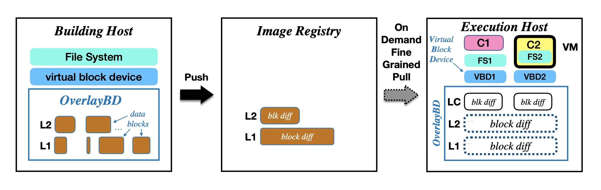
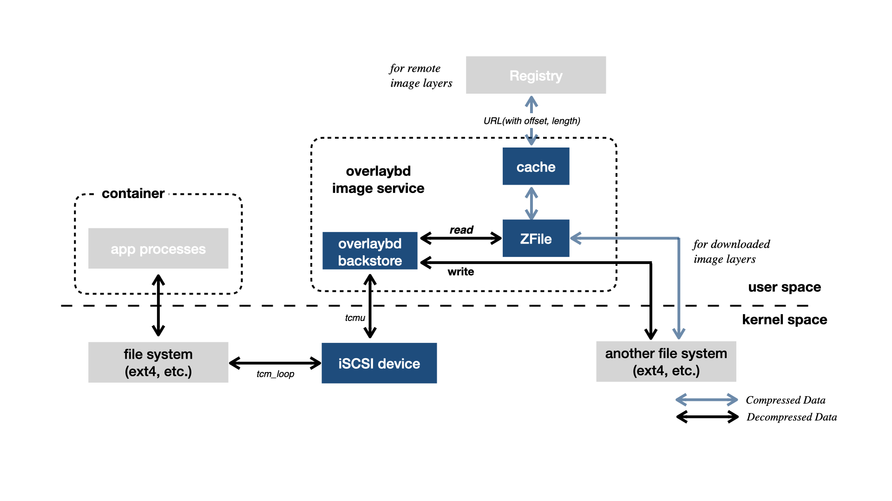

# Accelerated Container Image

Accelerated Container Image is an open-source implementation of paper **["DADI: Block-Level Image Service for Agile and Elastic Application Deployment. USENIX ATC'20"](https://www.usenix.org/conference/atc20/presentation/li-huiba)**.

DADI (Data Accelerator for Disaggregated Infrastructure) is a solution for container acceleration including remote image and other features which has been widely used in Alibaba and Alibaba Cloud. By now, it has been already integrated by **Alibaba Cloud Registry (ACR)**, and **Alibaba serverless services (FC [FaaSNet. USENIX ATC'21](https://www.usenix.org/system/files/atc21-wang-ao.pdf) / SAE / ECI, etc)** which enter **the Forrester leader quadrant**.

At the heart of the acceleration is overlaybd, which is a new remote image format based on block device. Overlaybd backstore provides a merged view of a sequence of block-based layers in userspace and outputs as a virtual blocks device through [TCMU](https://www.kernel.org/doc/Documentation/target/tcmu-design.txt).
It can be used for container acceleration by supporting fetching image data on-demand without downloading and unpacking the whole image before a container running. With overlaybd image format, we can cold start a container instantly.

The key features are:

* **High Performance**

    It's a block-device-based storage of OCI image, which has much lower complexity than filesystem-based implementations. For example, cross-layer hardlink and non-copy commands like chown are very complex for filesystem-based image without copying up, but is natively supported by overlaybd. Overlaybd outperforms filesystem-based solutions in performance. Evaluation data is stated in [DADI paper](https://www.usenix.org/conference/atc20/presentation/li-huiba).

* **High Reliability**

    Overlaybd outputs virtual block devices through TCMU, which is widely used and supported in most operation systems. Overlaybd backstore can recover from failures or crashes, which is difficult for FUSE-based image formats.

* **[Native Support for Writable](docs/WRITABLE.md)**

    Overlaybd can be used as writable/container layer. It can be used as container layer for runtime instead of overlayfs upper layer, or used to build overlaybd images.

* **[Multiple File System Supported](docs/MULTI_FS_SUPPORT.md)**

    Overlaybd outputs virtual block devices, which is supported to be formatted by multiple file system. It's convenient for user to choose ideal file system.

Accelerated Container Image is a __non-core__ sub-project of containerd.

## Components

* [overlaybd](https://github.com/containerd/overlaybd)

    Overlaybd provides a merged view of block-based layer sequence as an virtual block device in user space.

* overlaybd-snapshotter

    It is a [containerd](https://containerd.io/) snapshotter plugin for overlaybd image. This snapshotter is compatible for OCI image, as well as overlayfs snapshotter.

* image-convertor

    We provide a modified CLI tool(ctr) to facilitate image pull, and custom conversion from traditional OCI tarball format to overlaybd format.

    The convertor supports layer deduplication, which prevents duplication of layer convertion for every image conversion.

* [buildkit for overlaybd](https://github.com/data-accelerator/buildkit) (Experimental)

    It is a customized buildkit for overlaybd images. It fetches the data of base images on demand without pulling whole data and uses overlaybd writable layer to build new layers.

## Getting Started

* See how to setup overlaybd backstore at [README](https://github.com/containerd/overlaybd).

* See how to build snaphshotter and ctr plugin components at [BUILDING](docs/BUILDING.md).

* After build or install, see our [EXAMPLES](docs/EXAMPLES.md) about how to run an accelerated container. see [EXAMPLES_CRI](docs/EXAMPLES_CRI.md) if you run containers by k8s/cri.

* See the [PERFORMANCE](docs/PERFORMANCE.md) test about the acceleration.

* See how to convert OCI image into overlaybd with specified file system at [MULTI_FS_SUPPORT](docs/MULTI_FS_SUPPORT.md).

* See how to use layer deduplication for image conversion at [IMAGE_CONVERTOR](docs/IMAGE_CONVERTOR.md)

* See how to use overlaybd writable layer at [WRITABLE](docs/WRITABLE.md)

* Welcome to contribute! [CONTRIBUTING](docs/CONTRIBUTING.md)

## Overview

With OCI image spec, an image layer blob is saved as a tarball on the registry, describing the [changeset](https://github.com/opencontainers/image-spec/blob/v1.0.1/layer.md#change-types) based on it's previous layer. However, tarball is not designed to be seekable and random access is not supported. Complete downloading of all blobs is always necessary before bringing up a container.

An overlaybd blob is a collection of modified data blocks under the filesystem and corresponding to the files added, modified or deleted by the layer. The overlaybd backstore is used to provide the merged view of layers and provides a virtual block device. Filesystem is mounted on top of the device and an overlaybd blob can be accessed randomly and supports on-demond reading natively.

The raw data of block differences, together with an index to the raw data, constitute the overlaybd blob. When attaching and mounting an overlaybd device, only indexes of each layer are loaded from remote, and stored in memory. For data reading, overlaybd performs a range lookup in the index to find out where in the blob to read and then performs a remote fetching. That blob is in Zfile format.

Zfile is a new compression file format to support seekable decompression, which can reduce storage and transmission costs. And also the checksum information to protect against data corruptions for on-demand reading is stored in Zfile. In order to be compatible with existing registries and container engines, Zfile is wrapped by a tar file, which has only one Zfile inside.

Overlaybd connects with applications through a filesystem mounted on an virtual block device. Overlaybd is agnostic to the choice of filesystem so users can select one that best fits their needs. I/O requests go from applications to a regular filesystem such as ext4. From there they go to the loopback device (through TCM_loopback) and then to the user space overlaybd backstore (through TCMU). Backend read operations are always on layer files. Some of the layer files may have already been downloaded, so these reads would hit local filesystem. Other reads will be directed to registry, or hit the registry cache. Write and trim operations are handled by overlaybd backstore which writes the data and index files of the writable layer to the local file system. For more details, see the [paper](https://www.usenix.org/conference/atc20/presentation/li-huiba).

## Communication
For async communication and long running discussions please use issues and pull requests on the github repo. This will be the best place to discuss design and implementation.

For sync communication catch us in the #overlaybd slack channels on Cloud Native Computing Foundation's (CNCF) slack - cloud-native.slack.com. Everyone is welcome to join and chat. [Get Invite to CNCF slack.](https://communityinviter.com/apps/cloud-native/cncf)

## Licenses

Accelerated Container Image is released under the Apache License, Version 2.0.
