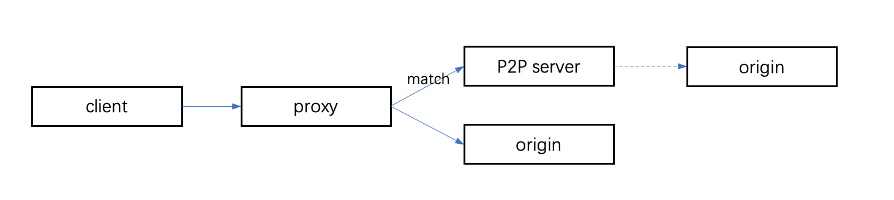

# Proxy Mode

We support forward proxy and reverse proxy.



## Forward Proxy

Client should set proxy manual.

## Reverse Proxy

You also can set proxy on server, client not need to config anything.

## HTTPS Support

HTTPS support needs a certificate to hijack connect requests.

First, you should set config `ProxyConfig.ProxyHTTPS` to true.

If you have a root certificate, you need to modify config `ProxyConfig.CertConfig`.

If you don't have a root certificate and want automatically generate one, you should add argument `--generate-cert` on the first start. We will automatically generate a certificate in the config `ProxyConfig.CertConfig` path.

Last, you should let the client trust the certificate, there are some examples:

**Ubuntu**

```shell
cp your-cert-path.crt /usr/local/share/ca-certificates/p2pcert.crt
update-ca-certificates
```

**CentOS**

```shell
cp your-cert-path.crt /etc/pki/ca-trust/source/anchors/p2pcert.crt
update-ca-trust
```